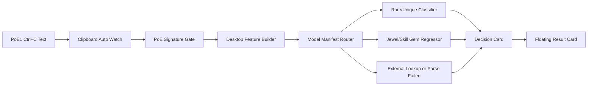

# Desktop App Current Status And Next Steps

## 목적

이 문서는 최종 보고서, 발표 자료, 다음 개발 계획을 작성할 때 참고할 수 있도록 2026-05-23 기준 Electron desktop 앱의 현재 상태와 남은 검증 항목을 정리한다.

## 현재 앱의 역할

Desktop 앱은 Path of Exile 1 영문 클라이언트에서 사용자가 아이템을 `Ctrl+C`로 복사하면, 로컬에서 아이템 텍스트를 파싱하고 모델 또는 fallback 정책을 통해 검색/판매 시도 우선순위를 알려주는 유틸리티다.

앱은 가격을 보장하는 판매 자동화 도구가 아니다. 목표는 “이 아이템을 거래소에서 확인할 가치가 있는지”를 빠르게 판단하는 것이다.

## 현재 구현된 사용자 흐름



## 모델 라우팅 상태

현재 앱은 `desktop/models/v2_mvp/model_manifest.json`을 기준으로 아이템 타입별 모델 또는 fallback을 선택한다.

| 대상 | 처리 방식 | 상태 |
| --- | --- | --- |
| Rare equipment | V2 mod-aware classifier | 구현 및 샘플 검증 완료 |
| Unique equipment | V2 mod-aware classifier | 구현 |
| Jewel | V1 summary regressor | 구현 및 샘플 검증 완료 |
| Skill gem | V1 summary regressor | 구현 및 샘플 검증 완료 |
| Currency / Map / Divination card | External price lookup recommendation | 구현 및 샘플 검증 완료 |
| Malformed PoE-like text | Parse failed | 구현 및 샘플 검증 완료 |

Decision label:

- `low listed value`
- `manual check`
- `search-worthy`
- `high-value candidate`
- `external price lookup recommended`
- `direct search recommended`
- `parse failed`

## 모델 학습/배치 자동화

`npm run prepare:desktop-models` 명령으로 desktop 앱용 모델 번들을 생성할 수 있다.

생성 대상:

```text
desktop/models/v2_mvp/rare_unique_classifier/
desktop/models/v2_mvp/jewel_regressor/
desktop/models/v2_mvp/skill_gem_regressor/
desktop/models/v2_mvp/model_manifest.json
```

이 자동화는 ETL 최신화 이후 모델 학습부터 앱용 artifact 복사까지 담당한다.

## Clipboard Auto Watch 상태

구현된 기능:

- Polling 기반 clipboard watcher
- 기본 polling interval `700ms`
- Auto Watch ON/OFF
- PoE item signature gate
- 일반 텍스트 조용히 무시
- hash 기반 중복 분석 방지
- debounce/cooldown
- in-flight guard와 latest pending only 정책

Mac 개발 환경에서 Notepad/샘플 기준 auto watch 동작은 확인되었다. 실제 PoE1 Windows 클라이언트에서의 클립보드 동작은 아직 최종 검증이 필요하다.

## Floating Result Card 상태

구현된 기능:

- Always-on-top floating card
- 결과 요약 표시
- `Auto hide` / `Keep visible` 모드
- opacity slider
- drag 이동
- 위치/설정 저장
- main window 결과와 동기화

Mac 개발 환경에서 기본 UI 조작은 확인되었다. Windows + PoE1 fullscreen/windowed 환경에서 always-on-top 동작은 추가 확인이 필요하다.

## Windows Installer 준비 상태

최종 제출용으로 Windows installer 배포 가능성을 고려해 다음 구조를 구현했다.

- `electron-builder` 도입
- NSIS installer target 설정
- embedded Python 준비 스크립트 추가
- packaged mode에서 `process.resourcesPath` 기반 runtime path 사용
- packaged mode에서 `npm`/`tsx` 없이 build된 JS feature builder 사용
- `desktop/vendor/python-win/`을 app resources의 `python/`으로 포함
- `desktop/models/v2_mvp/`를 app resources의 `models/v2_mvp/`로 포함
- `ml/predict_desktop_item_value.py`를 resources에 포함
- packaging prerequisite check 추가

중요한 점:

- 실제 Python runtime은 Git에 포함하지 않는다.
- Windows 빌드 머신에서 `desktop/scripts/prepare-embedded-python.ps1`로 생성한다.
- macOS에서는 실제 Windows installer 최종 실행 검증을 완료할 수 없다.

## 남은 최우선 검증

남은 작업은 구현보다는 Windows 환경 검증에 가깝다.

1. Windows에서 development mode 실행
   - `desktop/scripts/setup-windows.ps1`
   - `npm start`
   - `Run Check`
2. Windows에서 실제 PoE1 클라이언트 테스트
   - `Ctrl+C`가 polling watcher에 잡히는지 확인
   - 일반 텍스트 복사 시 조용히 무시되는지 확인
   - 동일 아이템 반복 분석 방지 확인
3. Floating card 테스트
   - PoE1 창 위에 표시되는지 확인
   - drag 이동 가능 여부 확인
   - opacity/keep visible 설정 유지 확인
4. Installer build 테스트
   - embedded Python 준비
   - `npm run verify:package-prereqs`
   - `npm run dist:win`
5. Installed app smoke test
   - 설치 후 Python/Node 없이 실행되는지 확인
   - demo sample 분석 확인
   - live `Ctrl+C` 확인

## 보고서 작성 포인트

최종 리포트에서는 다음 관점을 강조할 수 있다.

- 모델 자체보다 “로컬 유틸리티로 동작하는 전체 시스템”을 구현했다.
- 모든 아이템을 하나의 모델로 억지 예측하지 않고 item routing layer를 도입했다.
- `jewel`, `skill_gem`은 V1 summary regressor로 확장했고, rare/unique는 V2 mod-aware classifier를 유지했다.
- commodity-like item은 모델 예측 대신 external price lookup으로 안내해 오판 위험을 줄였다.
- Auto Watch와 floating card를 통해 실제 게임 중 사용성을 고려했다.
- 최종 제출을 위해 installer 배포 구조까지 고려했다.

## 리스크와 한계

- Listed price 기반 모델이므로 실제 체결가를 보장하지 않는다.
- `jewel`, `skill_gem`의 clipboard feature 재현 품질은 rare/unique V2 feature보다 낮을 수 있다.
- CatBoost/Python runtime 포함으로 installer 크기가 커질 수 있다.
- Windows packaged app에서 embedded Python + native CatBoost import 검증이 필요하다.
- 게임 창 모드, fullscreen mode, Windows focus policy에 따라 floating card 동작이 달라질 수 있다.

## 다음 액션

가장 가까운 다음 액션은 두 가지다.

1. Windows에서 installer build 가능 여부 확인
2. Windows + 실제 PoE1 클라이언트에서 Auto Watch와 floating card를 검증

이 두 가지가 통과하면 최종 발표용 desktop 앱은 기능적으로 마무리 단계로 볼 수 있다.
