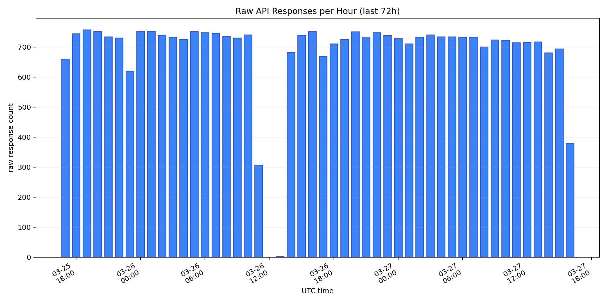
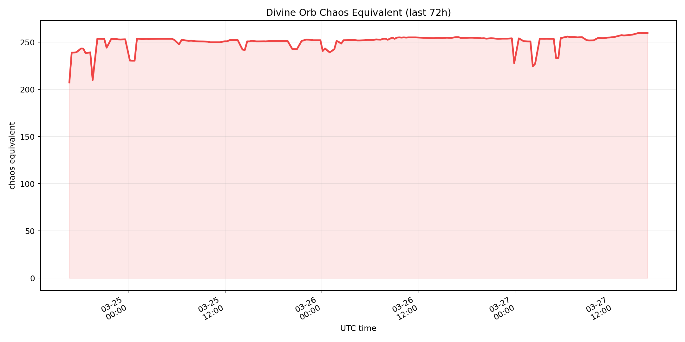
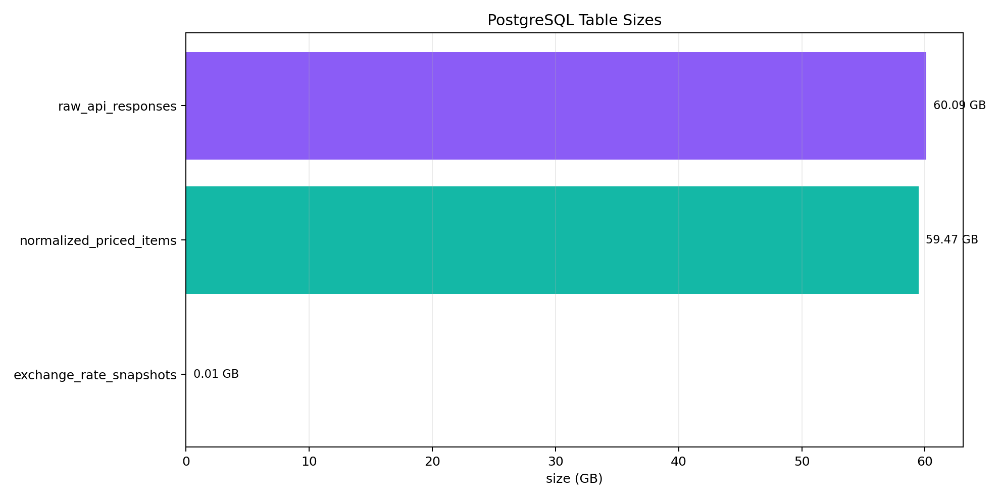
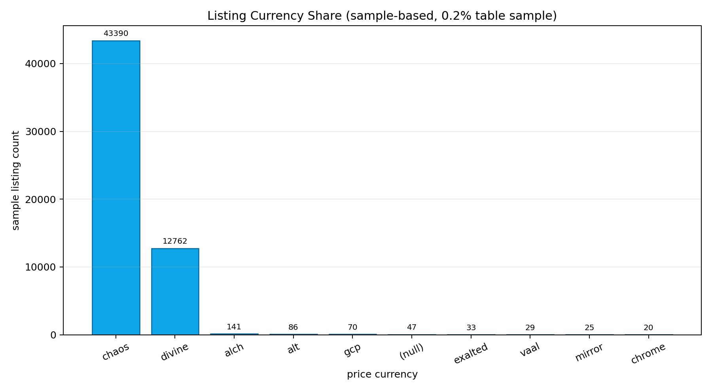
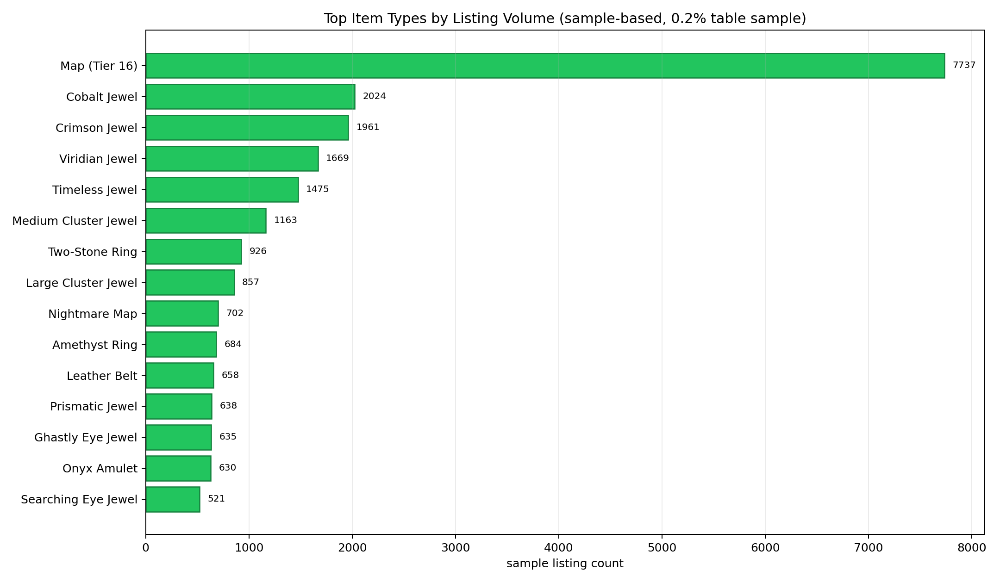
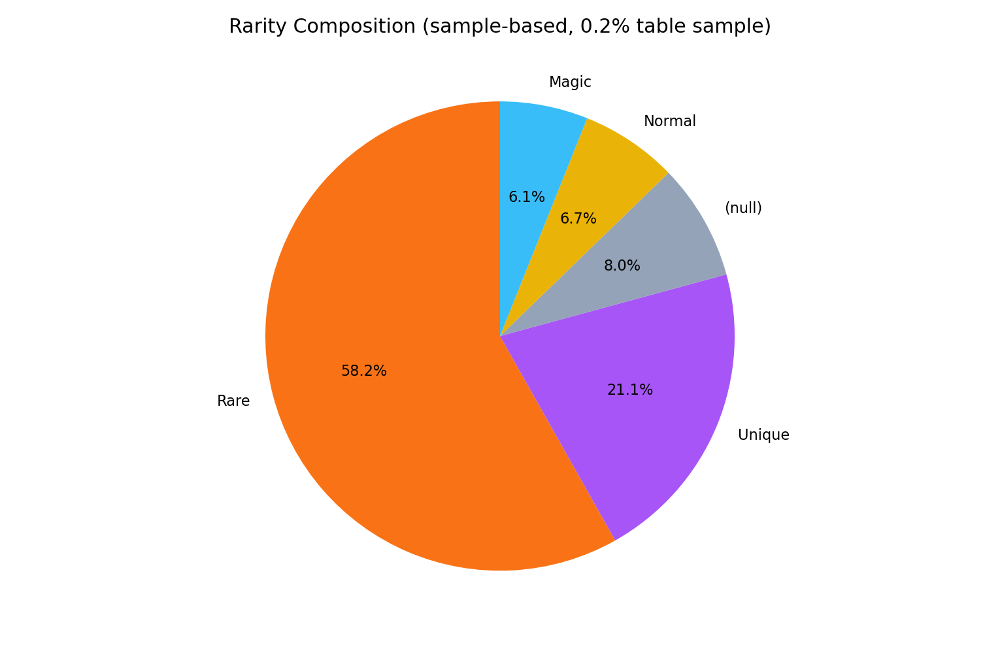
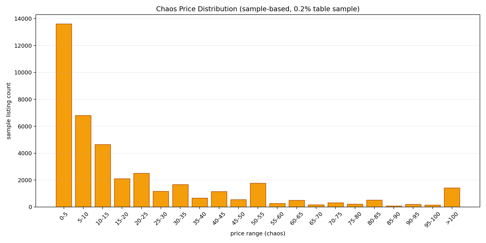
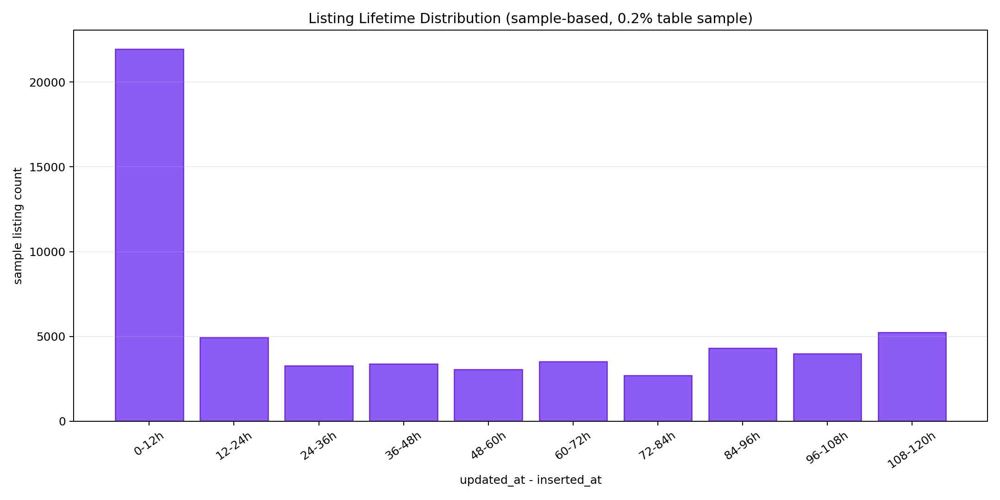

# PoE1 Local Item Value Prediction System

## 2026-03-28 중간보고

## 프로젝트 개요

본 프로젝트는 Path of Exile 1의 `public-stash-tabs` 데이터를 로컬에서 지속 수집하고, 이후 가격 예측 모델 학습에 활용할 수 있는 형태로 정리하는 것을 목표로 하는 PoC입니다.

현재는 모델 학습 이전 단계로서, 실시간 수집 파이프라인 구축, 데이터 적재 안정화, 시장 데이터 구조 파악에 집중하고 있습니다.

## 현재 운영 구조

- `collector`: 실시간 stash 데이터 수집
- `maintenance`: raw 정리, normalized archive sweep, 환율 스냅샷 수집
- `ETL`: 아직 미실행

현재 수집은 `Mirage` 소프트코어 시장을 기준으로 진행하고 있습니다.

## 데이터 현황

| 항목 | 현재 수치 |
| --- | --- |
| `raw_api_responses` | `32,337` rows |
| 최근 24시간 raw | `17,346` rows |
| `normalized_priced_items` | 약 `28,100,631` rows |
| `exchange_rate_snapshots` | `15,490` rows |
| `raw_api_responses` 크기 | 약 `60 GB` |
| `normalized_priced_items` 크기 | 약 `59 GB` |
| `exchange_rate_snapshots` 크기 | 약 `6.5 MB` |

최근 확인된 Divine Orb chaos 환산값은 `257.6 ~ 259.8 chaos` 범위였습니다.

## 프로젝트 방향 정리

초기에는 Public Stash 전체를 넓게 수집하고 모든 아이템 가격 예측까지 염두에 두었지만, 실제 수집을 진행하면서 프로젝트 방향을 더 구체화했습니다.

현재는 `Mirage` 소프트코어 시장만 대상으로 고정하고 있습니다.  
`Hardcore Mirage`, `SSF Mirage`, `Ruthless Mirage`, private league는 별도 경제권으로 보고 제외했습니다.

또한 모든 아이템을 동일하게 예측하는 방향이 아니라, 외부 시세만으로 판단하기 어려운 아이템에 예측 자원을 집중하는 방향으로 범위를 조정했습니다.

외부 시세 우선 대상:

- Currency
- Fragment
- Scarab
- Essence
- Fossil
- Oil
- Divination Card
- 일반 Map
- 옵션 차이가 거의 없는 유니크 일부

모델 예측 우선 대상:

- Rare 장비
- Rare Jewel / Abyss Jewel / Cluster Jewel
- 옵션 roll 차이가 큰 Unique 장비
- Skill Gem

## 수집 파이프라인 상태

최근 72시간 기준 raw 수집량입니다. 시간대별로 응답이 계속 누적되고 있어, 수집 파이프라인이 안정적으로 동작하고 있음을 확인할 수 있습니다.

환율 스냅샷도 함께 누적하고 있습니다. 이후 ETL 단계에서 `target_price_chaos` 라벨을 만들기 위한 기반 데이터로 사용됩니다.

현재 PostgreSQL 저장 규모입니다. raw와 normalized가 동시에 빠르게 증가하고 있어, retention과 archive 정책이 운영 구조에서 중요하게 작용합니다.

## 수집 데이터의 특징

현재 수집된 시장 데이터는 가격 통화가 `chaos`와 `divine`에 크게 집중되어 있습니다. 이 특성 때문에 통화 단위를 통합하는 환율 정규화가 필수적입니다.

아이템 타입 분포를 보면, Jewel 계열과 Map 계열, 장신구 계열이 수집 데이터에서 크게 나타납니다. 즉 실제 시장 데이터는 아이템 타입별 비중이 매우 불균형하며, 이 구조를 고려한 분류와 ETL이 필요합니다.

희귀도 구성에서는 Rare와 Unique의 비중이 높게 나타났습니다. 이는 이후 모델 후보군을 Rare 장비, Jewel, 일부 Unique, Skill Gem 중심으로 가져가는 현재 방향과도 잘 맞습니다.

Chaos 가격 분포는 저가 매물이 많고 고가 매물은 상대적으로 적은 롱테일 구조를 보입니다. 이 때문에 단순 평균가 접근보다 feature 기반 예측이 더 중요해집니다.

매물 생존 시간 분포를 보면, 등록 직후 바로 사라지는 매물만 있는 것이 아니라 일정 시간 이상 유지되는 매물도 큰 비중을 차지합니다. 이는 향후 stale listing 정리 기준과 학습용 데이터 유지 기간을 정하는 데 중요한 관찰 결과입니다.

## 정리

현재 프로젝트는 단순 API 호출 수준을 넘어, 실제로 연속 수집과 유지 관리가 가능한 데이터 수집 파이프라인 단계에 들어와 있습니다.

또한 실제 시장 데이터를 수집하면서,

- 어떤 리그를 대상으로 볼 것인지
- 어떤 아이템을 외부 시세로 처리할 것인지
- 어떤 아이템을 모델 예측 대상으로 삼을 것인지

를 데이터 기반으로 구체화하고 있습니다.

다음 단계에서는 누적된 수집 데이터를 바탕으로 `training_features_raw -> clean -> labeled` ETL을 실행하고, CatBoost 학습 이전의 feature 품질과 라벨 품질을 점검할 예정입니다.
