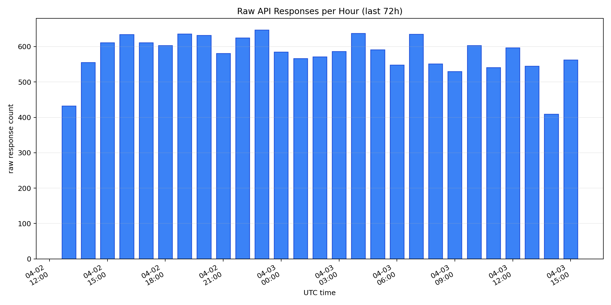
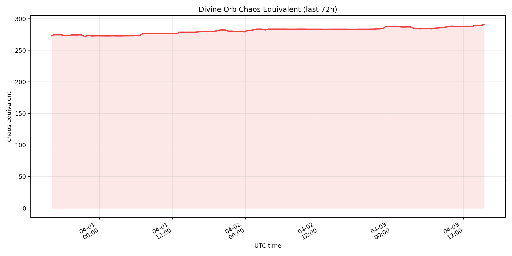
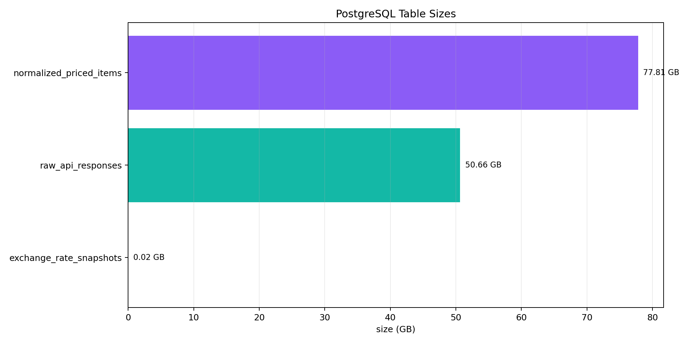
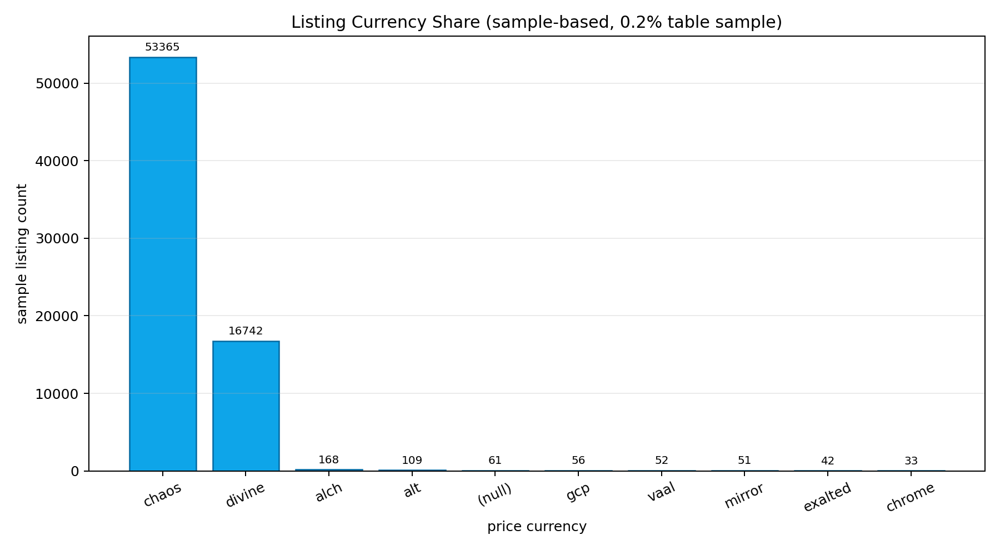
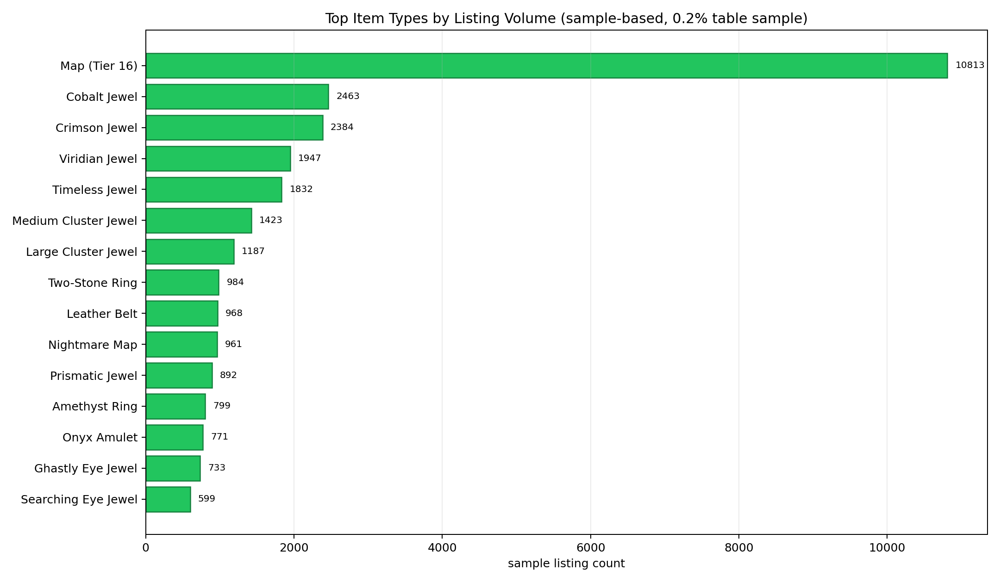
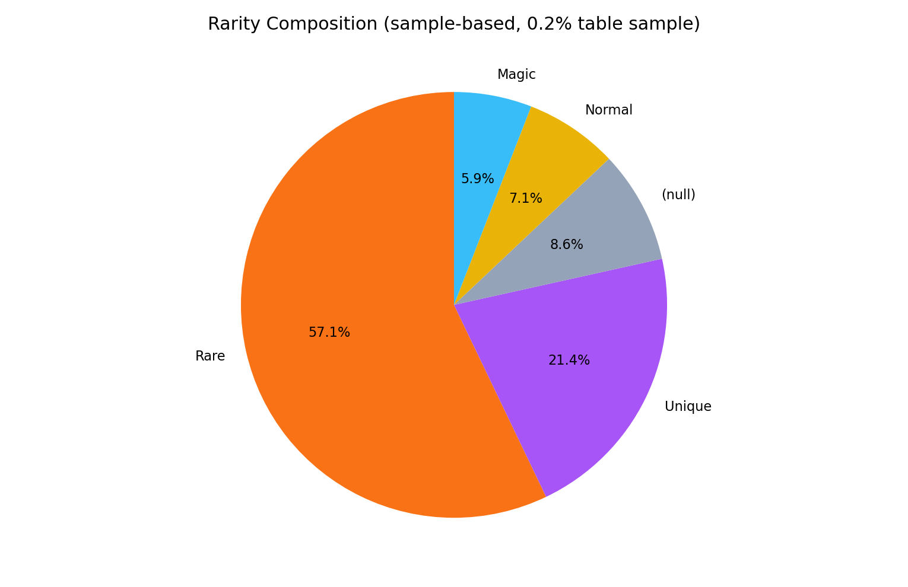
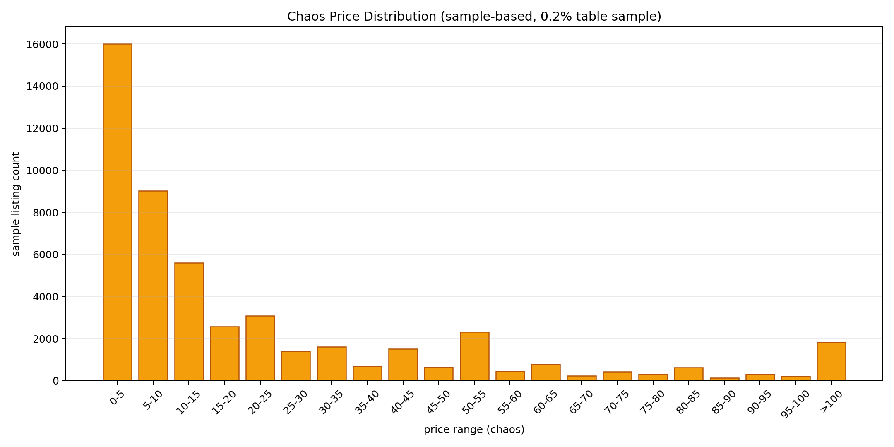
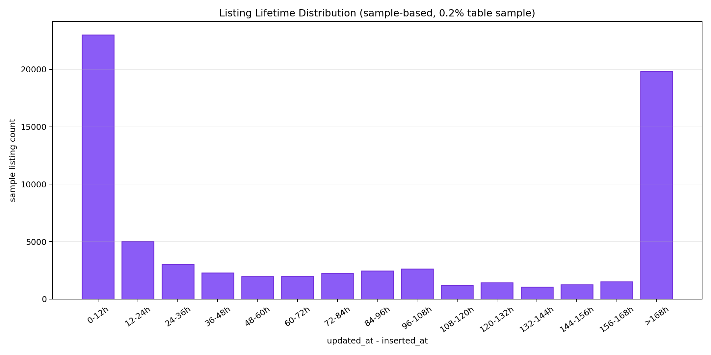

# PoE1 Local Item Value Prediction System

## 2026-04-04 발표용 리포트

이 문서는 `2026-04-04_mid_report.md`의 핵심 내용을 유지하면서, 같은 폴더의 PNG 차트를 한 번에 함께 볼 수 있도록 정리한 발표용 문서입니다.

## 현재 상태 요약

- 수집 대상: `Mirage` 소프트코어 거래 시장
- 현재 운영 상태: 이번 점검 시점에는 `collector`, `maintenance` 모두 수동 정지
- 이번 주 목표: 수집량 확대보다 장기 운영 안정화와 이후 ETL 준비
- 다음 주 목표: `training_features_raw` / `clean` / `labeled` 생성 및 `CatBoost` 1차 학습

## 주요 수치

| 항목 | 현재 수치 |
| --- | --- |
| `raw_api_responses` | 약 `15,258` rows |
| `normalized_priced_items` | 약 `35,498,507` rows |
| `exchange_rate_snapshots` | 약 `40,613` rows |
| `ingestion_activity_summaries` | 약 `731` rows |
| `normalized_priced_items` 저장 크기 | 약 `78 GB` |
| `raw_api_responses` 저장 크기 | 약 `51 GB` |

## 핵심 해석

1. 수집 파이프라인은 장시간 운영 가능한 형태로 안정화되었습니다.
2. `normalized_priced_items`가 이미 수천만 행 규모이므로, 학습 실험을 시작할 기반 데이터는 충분히 확보되고 있습니다.
3. 현재 라벨은 어디까지나 관측 시점의 listing price이며, 판매 완료 가격이나 판매 시점 라벨은 아닙니다.
4. 따라서 다음 단계의 중심 과제는 추가 수집보다 ETL과 학습용 데이터셋 생성입니다.

## 시각화 자료

아래 차트 중 `last 72h`는 최근 구간 실제 집계이고, `sample-based` 차트는 `normalized_priced_items TABLESAMPLE SYSTEM (0.2)` 기반 탐색용 시각화입니다.

### 시간대별 Raw 수집량

### Divine Orb 환율 추이

### PostgreSQL 테이블 규모

### 가격 통화 분포

### 상위 아이템 타입 분포

### 희귀도 구성

### Chaos 가격 분포

### 관측 유지 시간 분포

## 정리

이번 보고 시점의 핵심 메시지는, 데이터 수집 인프라는 충분히 확보되었고 이제는 실제 학습용 데이터 생성과 `CatBoost` 학습 검증 단계로 넘어갈 준비가 되어 있다는 점입니다.
