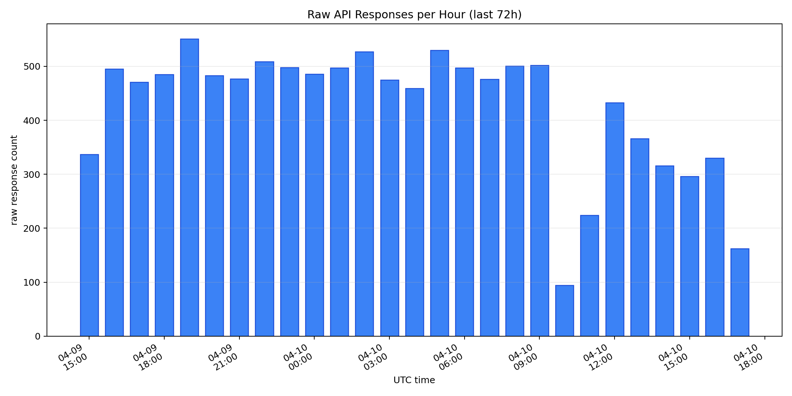
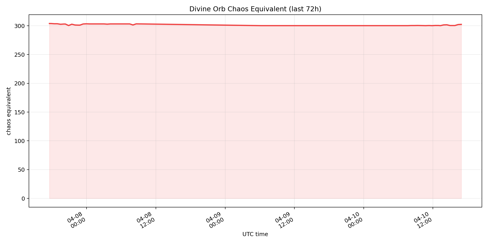
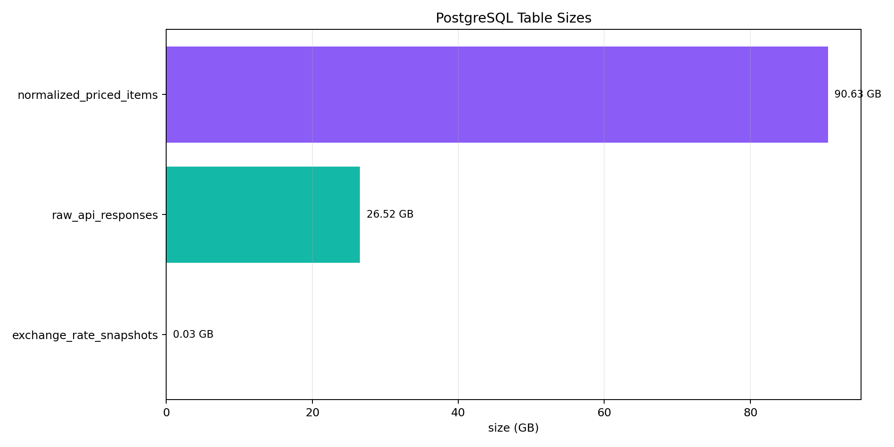
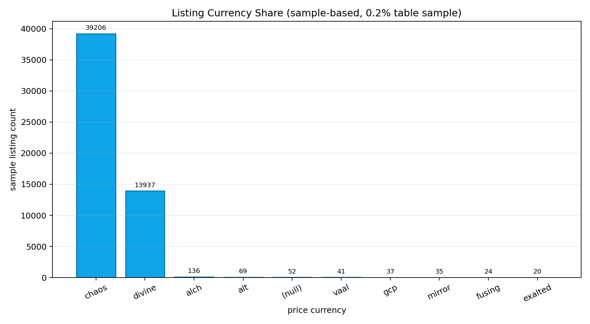
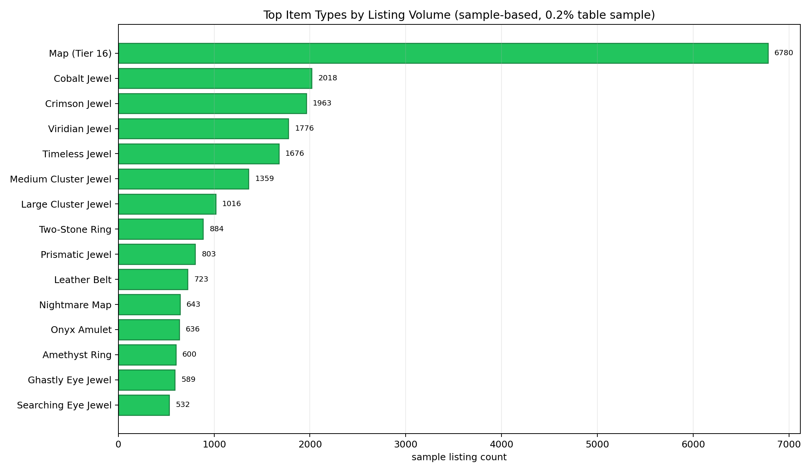
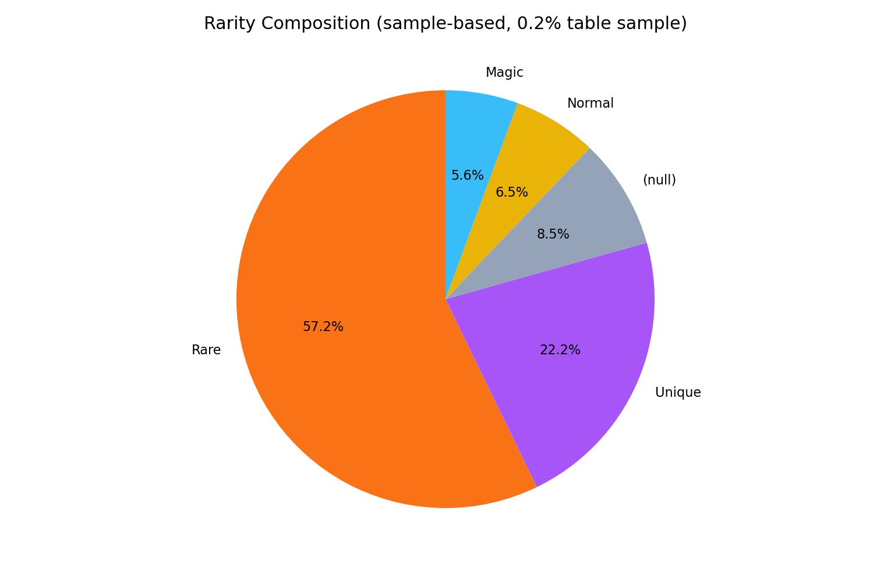
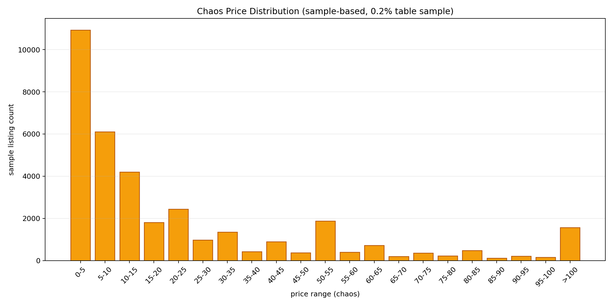
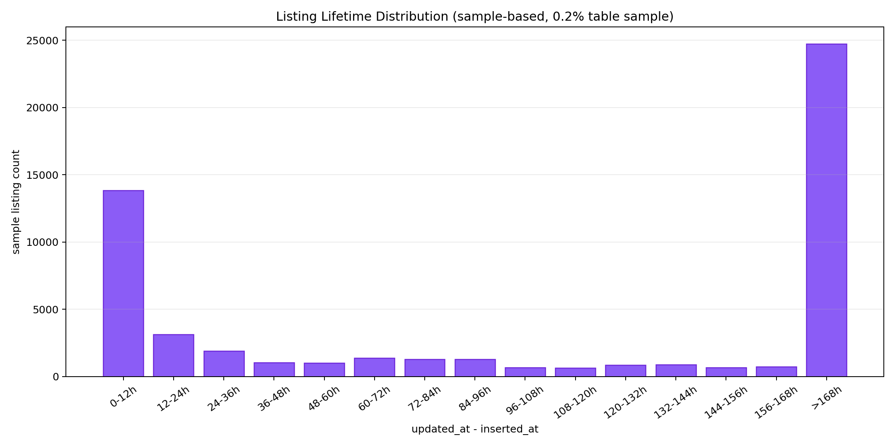

# PoE1 Local Item Value Prediction System

## 2026-04-11 발표용 리포트

이 문서는 `2026-04-11_mid_report.md`의 핵심 내용을 유지하면서, 같은 폴더의 PNG 차트를 함께 볼 수 있도록 정리한 발표용 문서입니다.

## 현재 상태 요약

- 수집 대상: `Mirage` 소프트코어 거래 시장
- 현재 운영 상태: `collector`, `maintenance`, `ETL` 모두 동작 중
- 이번 주 목표: ETL 구조 안정화와 학습용 테이블 실제 누적
- 다음 주 목표: labeled dataset export 및 `CatBoost` 1차 학습

## 주요 수치

| 항목 | 현재 수치 |
| --- | --- |
| `raw_api_responses` | `11,484` rows |
| `normalized_priced_items` | 약 `27,041,952` rows (추정치) |
| `exchange_rate_snapshots` | `60,245` rows |
| `ingestion_activity_summaries` | `1,181` rows |
| `training_features_raw` | `611,000` rows |
| `training_features_clean` | `26,848` rows |
| `training_features_labeled` | `26,848` rows |
| `normalized_priced_items` 저장 크기 | 약 `97.3 GB` |
| `raw_api_responses` 저장 크기 | 약 `28.5 GB` |

## 핵심 해석

1. 수집 인프라는 이미 상시 운영 가능한 수준으로 정리되었습니다.
2. 통합 ETL runner가 실제 backlog를 따라가며 `raw -> clean -> labeled`를 누적하고 있습니다.
3. `training_features_*` 계층은 `normalized_priced_items`보다 훨씬 작은 크기로 유지되어, 장기적으로 canonical dataset 계층으로 적합합니다.
4. 현재 모델 준비 단계의 핵심은 추가 수집보다 ETL 진도와 첫 `CatBoost` 학습 실행입니다.
5. clipboard-safe feature whitelist까지 코드에 반영되어, 학습 입력 범위도 예전보다 명확해졌습니다.

## 시각화 자료

아래 차트 중 `last 72h`는 최근 구간 실제 집계이고, `sample-based` 차트는 `normalized_priced_items TABLESAMPLE SYSTEM (0.2)` 기반 탐색용 시각화입니다.

### 시간대별 Raw 수집량

### Divine Orb 환율 추이

### PostgreSQL 테이블 규모

### 가격 통화 분포

### 상위 아이템 타입 분포

### 희귀도 구성

### Chaos 가격 분포

### 관측 유지 시간 분포

## 정리

이번 보고 시점의 핵심 메시지는, **수집 인프라는 이미 충분히 확보되었고, 현재 프로젝트의 중심은 학습용 ETL 누적과 첫 `CatBoost` 학습 실행으로 이동했다**는 점입니다.
