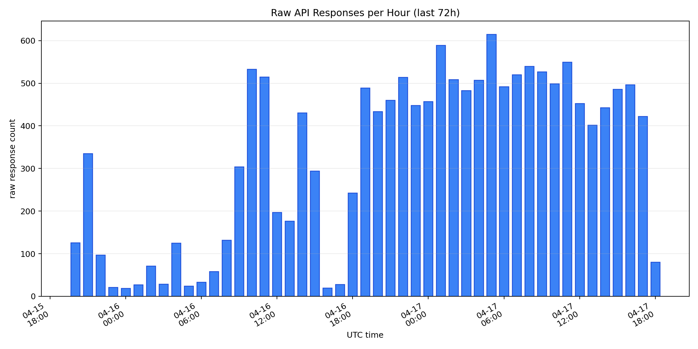
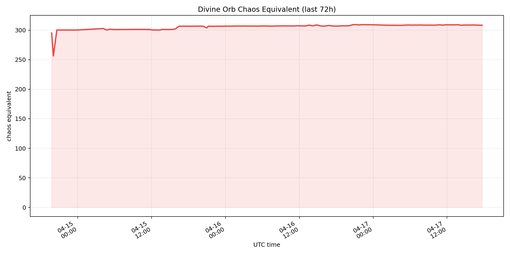
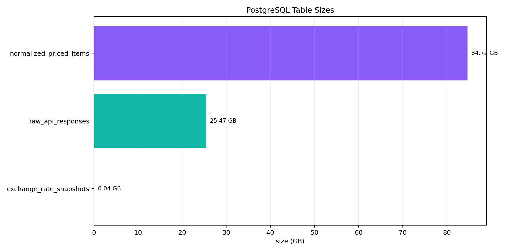
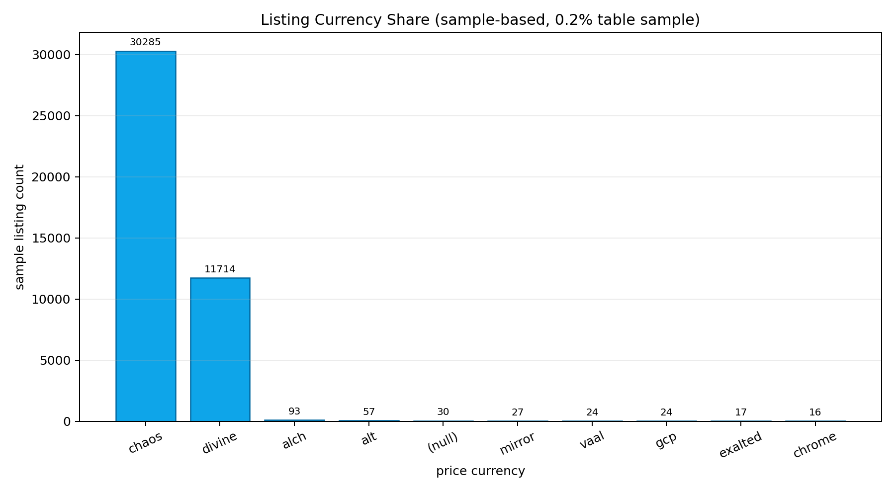
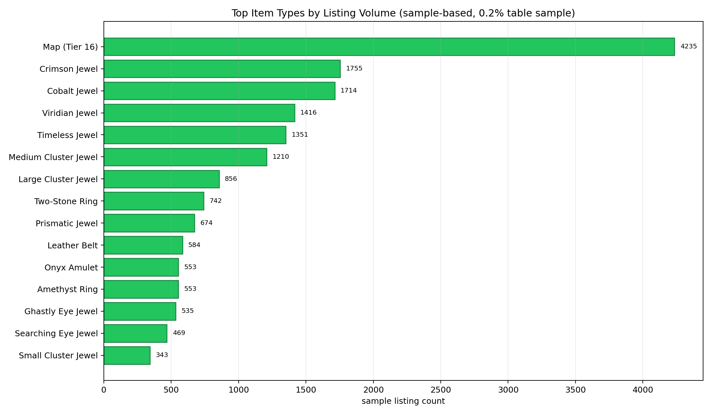
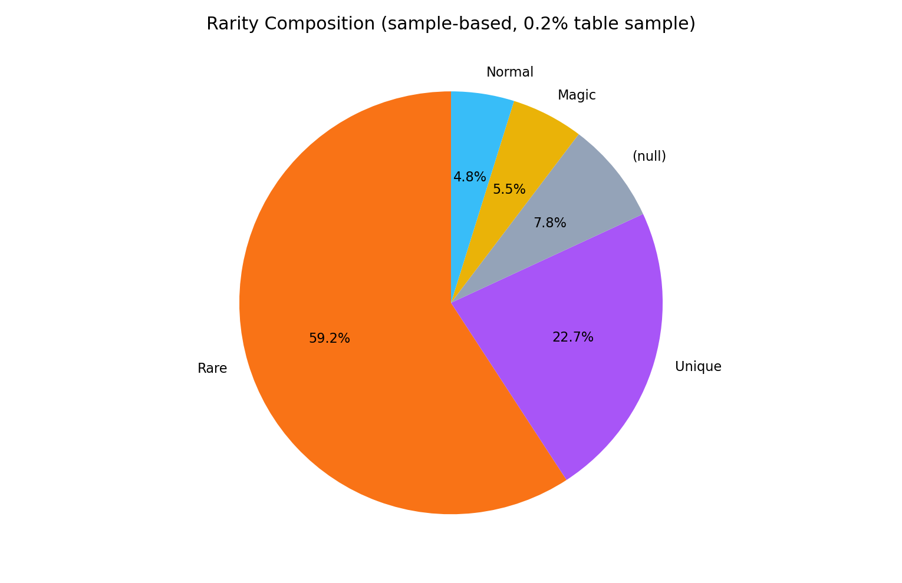
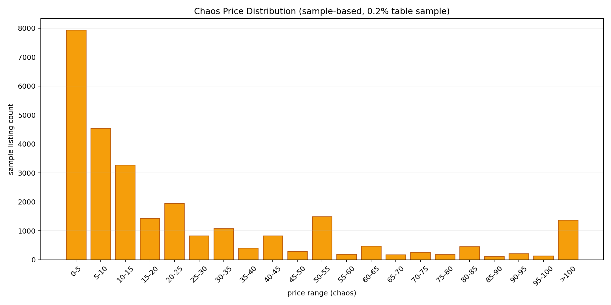
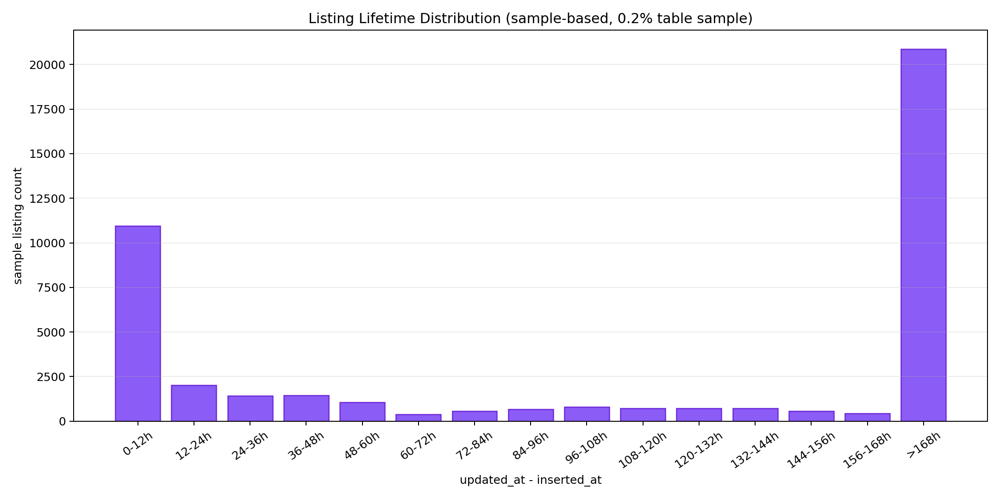

# PoE1 Local Item Value Prediction System

## 2026-04-18 발표용 리포트

이 문서는 `2026-04-18_mid_report.md`의 핵심 내용을 유지하면서, 같은 폴더의 PNG 차트와 이번 주 모델 비교 결과를 함께 볼 수 있도록 정리한 발표용 문서입니다.

## 현재 상태 요약

- 수집 대상: `Mirage` 소프트코어 거래 시장
- 현재 운영 상태: `collector`, `maintenance`는 운영 중, ETL은 최근 7일 학습 범위까지 반영 완료
- 이번 주 핵심 성과: 최근 7일 전체 데이터로 글로벌/세그먼트 모델 비교 실행 완료
- 현재 기준선: `model_segment` 라우팅 기반 세그먼트 모델 4종

## 주요 수치

| 항목 | 현재 수치 |
| --- | --- |
| `raw_api_responses` | `15,260` rows |
| `normalized_priced_items` | `21,546,170` rows |
| `exchange_rate_snapshots` | `84,921` rows |
| `training_features_raw` | `23,830,317` rows |
| `training_features_clean` | `15,862,949` rows |
| `training_features_labeled` | `15,862,949` rows |
| 최근 7일 staged snapshot | `14,496,401` rows |
| 글로벌 모델 test RMSE | `1.8808` |

최근 7일 `training_features_labeled` 세그먼트 분포:

| 세그먼트 | row 수 |
| --- | ---: |
| `rare_equipment` | `6,905,969` |
| `jewel` | `4,926,245` |
| `unique_equipment` | `1,459,370` |
| `skill_gem` | `1,171,052` |

## 모델 비교 핵심 결과

이번 주 기준선 비교 런:

- `ml/runs/comparison_last_7d_full_baseline_100iter_d8`
- `target_price_log1p`
- `iterations=100`, `depth=8`, `learning_rate=0.05`

세그먼트별 test `target_price_log1p_rmse`:

| 세그먼트 | 글로벌 모델 | 세그먼트 모델 | 결과 |
| --- | ---: | ---: | --- |
| `jewel` | `1.9318` | `1.8346` | 세그먼트 모델 우세 |
| `rare_equipment` | `1.8014` | `1.7666` | 세그먼트 모델 우세 |
| `skill_gem` | `1.7292` | `1.6902` | 세그먼트 모델 우세 |
| `unique_equipment` | `2.1276` | `1.9380` | 세그먼트 모델 우세 |

즉, 현재 실험 범위에서는 **글로벌 1개 모델보다 세그먼트별 분리 모델이 모든 구간에서 더 좋은 성능**을 보였습니다.

## 핵심 해석

1. 최근 7일 전체 데이터로 실제 학습/비교가 가능한 파이프라인을 확보했습니다.
2. staged split 기반 경로 덕분에 대용량 데이터에서도 로컬 장비에서 실험이 가능했습니다.
3. 현재 운영 기준선은 글로벌 단일 모델보다 `model_segment` 라우팅 모델이 더 적절합니다.
4. 따라서 추후 로컬 유틸리티 앱도 `세그먼트 판별 -> 해당 모델 선택` 구조로 설계하는 것이 자연스럽습니다.

## 시각화 자료

아래 차트 중 `last 72h`는 최근 구간 실제 집계이고, `sample-based` 차트는 `normalized_priced_items TABLESAMPLE SYSTEM (0.2)` 기반 탐색용 시각화입니다.

### 시간대별 Raw 수집량

### Divine Orb 환율 추이

### PostgreSQL 테이블 규모

### 가격 통화 분포

### 상위 아이템 타입 분포

### 희귀도 구성

### Chaos 가격 분포

### 관측 유지 시간 분포

## 정리

이번 보고 시점의 핵심 메시지는, **이 프로젝트가 데이터 수집과 ETL 정리를 넘어서, 실제로 사용할 수 있는 세그먼트 기준선 모델을 확보한 단계까지 도달했다**는 점입니다.
