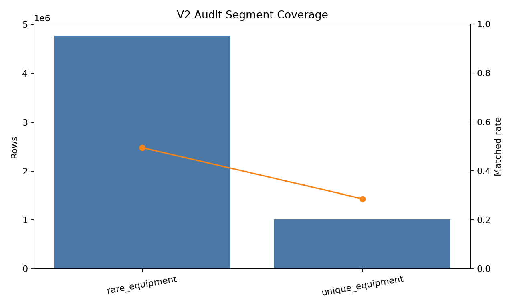
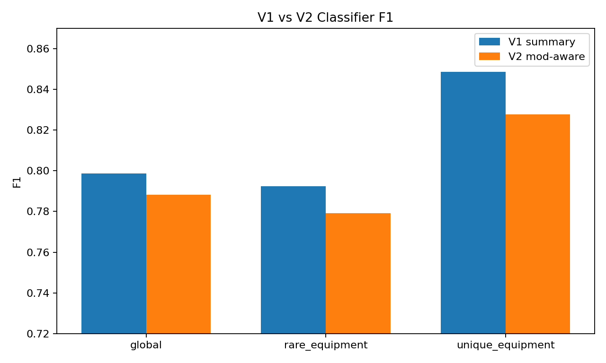
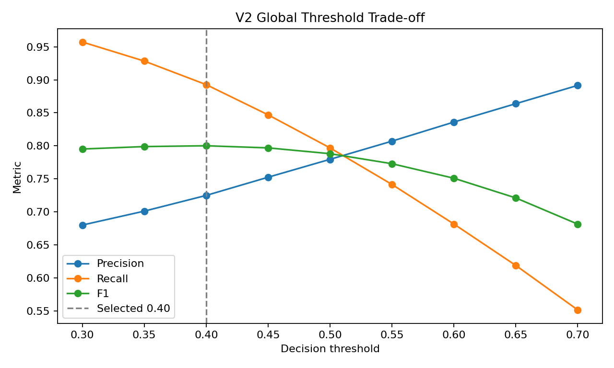

# PoE1 Local Item Value Prediction System

## 2026-05-02 V2 주차 보고서

이번 주 보고서는 기존 주차 보고서의 데이터 수집 현황 요약을 생략하고, **V2 mod-aware classifier와 로컬 앱 MVP 연결 준비 상태**만 정리한다.

이번 주의 핵심 변화는 V1 가격 회귀/요약 피처 중심 실험에서 한 단계 나아가, 실제 최종 발표에서 시연 가능한 형태인 **영문 `Ctrl+C` 아이템 텍스트 -> V2 feature builder -> CatBoostClassifier -> 로컬 앱 판단 결과** 흐름을 구현하고 검증한 것이다.

## 이번 주 목표

V2의 목표는 정확한 체결가 예측이 아니라, 공개 priced listing 데이터를 기준으로 아이템이 `search-worthy`인지 판단하는 것이다.

```text
is_search_worthy = target_price_chaos >= 30
```

또한 `1 divine equivalent` 이상은 high-value 후보로 별도 추적한다. 이번 실행 시점의 divine 기준값은 `311.7 chaos`였다.

## 구현 및 실험 산출물

이번 주에 생성한 주요 산출물은 다음과 같다.

| 항목 | 경로 |
| --- | --- |
| V2 audit 결과 | `artifacts/v2_mod_audit/latest` |
| V2 staged dataset | `artifacts/v2-mod-aware-staging/2026-05-01_full_7d` |
| V2 classifier run | `ml/runs/v2_classifier_2026-05-01_full_7d` |
| V2 Electron 앱 MVP | `desktop/` |
| threshold 평가 | `ml/runs/v2_classifier_2026-05-01_full_7d/v2_mod_aware/global/threshold_eval` |

V2 staged dataset은 최근 7일 기준 `rare_equipment`와 `unique_equipment`만 대상으로 생성했다.

| 항목 | 값 |
| --- | ---: |
| staging row 수 | `5,642,555` |
| source window | 최근 `7`일 |
| snapshot 기준 | `2026-05-01 15:33:31 UTC` |
| search-worthy 기준 | `30 chaos` |
| high-value 기준 | `311.7 chaos` |

## Phase 0 Audit 결과

Phase 0 audit의 목적은 실제 학습 전에 V2 feature를 만들 수 있을 정도로 기존 수집 데이터에 mod line이 보존되어 있는지 확인하는 것이었다.

| segment | rows | explicit_mod_preservation_rate | matched_rate | search_worthy_rows | high_value_rows |
| --- | --- | --- | --- | --- | --- |
| rare_equipment | 4,774,575 | 0.9999 | 0.4949 | 2,692,505 | 1,504,438 |
| unique_equipment | 1,008,294 | 0.9945 | 0.2857 | 620,557 | 382,588 |

해석:

- `explicitMods` 보존율은 rare/unique 모두 충분히 높아, 기존 `item_json`으로 V2 feature 재처리가 가능하다.
- `rare_equipment`의 exact match rate는 약 `49.5%`로 1차 실험 가능한 수준이다.
- `unique_equipment`의 match rate는 약 `28.6%`로 낮다. 고유 옵션 문구가 많고 rare affix dictionary 중심 매칭과 맞지 않는 케이스가 많기 때문이다.
- 따라서 V2는 당장 unique에서 완전한 affix-aware 모델이라고 보기는 어렵고, `unique_name`, roll summary, unmatched/ambiguous count 중심의 보조 feature로 해석하는 것이 맞다.



## V1 vs V2 Classifier 비교

이번 실험은 동일한 7일 snapshot과 동일한 split에서 다음 두 feature set을 비교했다.

- `v1_summary`: 기존 clipboard-safe summary feature
- `v2_mod_aware`: mod line 기반 matched/ambiguous/unmatched count, family roll summary, prefix/suffix candidate, unique identity feature

| scope | v1_precision | v1_recall | v1_f1 | v2_precision | v2_recall | v2_f1 | winner |
| --- | --- | --- | --- | --- | --- | --- | --- |
| global | 0.8067 | 0.7909 | 0.7987 | 0.7796 | 0.7969 | 0.7881 | v2_mod_aware |
| rare_equipment | 0.7959 | 0.7888 | 0.7923 | 0.7758 | 0.7825 | 0.7791 | v1_summary |
| unique_equipment | 0.8326 | 0.8652 | 0.8486 | 0.8072 | 0.8492 | 0.8277 | v1_summary |



결과 해석:

1. `global` 기준에서는 V2가 recall을 소폭 개선해 winner 기준상 `v2_mod_aware`로 판정됐다.
2. 그러나 precision과 F1은 V1 global이 더 높다.
3. `rare_equipment`, `unique_equipment` segment 모델에서는 V1 summary가 precision / recall / F1 모두 더 좋았다.
4. 즉 V2는 **앱에 연결 가능한 mod-aware feature path를 확보했다는 점에서는 성공**했지만, 성능상 V1을 완전히 대체했다고 보기는 어렵다.

## Threshold 튜닝

기본 threshold `0.50`은 V2 global 모델의 F1과 recall 균형이 좋지 않았다. 앱 MVP는 비싼 아이템을 놓치지 않는 것을 우선하므로 threshold를 별도로 평가했다.

| threshold | precision | recall | f1 | false_negative | high_value_miss_rate |
| --- | --- | --- | --- | --- | --- |
| 0.3 | 0.6800 | 0.9573 | 0.7952 | 14939 | 0.0292 |
| 0.35 | 0.7011 | 0.9284 | 0.7989 | 25036 | 0.0497 |
| 0.4 | 0.7249 | 0.8927 | 0.8001 | 37516 | 0.0752 |
| 0.45 | 0.7525 | 0.8470 | 0.7969 | 53515 | 0.1085 |
| 0.5 | 0.7796 | 0.7969 | 0.7881 | 71028 | 0.1462 |
| 0.55 | 0.8071 | 0.7415 | 0.7729 | 90389 | 0.1891 |
| 0.6 | 0.8360 | 0.6816 | 0.7509 | 111358 | 0.2370 |
| 0.65 | 0.8639 | 0.6188 | 0.7211 | 133293 | 0.2903 |
| 0.7 | 0.8916 | 0.5514 | 0.6814 | 156856 | 0.3494 |



이번 결과에서는 `threshold=0.40`이 가장 균형이 좋았다.

| 기준 | threshold 0.50 | threshold 0.40 |
| --- | ---: | ---: |
| precision | 0.7796 | 0.7249 |
| recall | 0.7969 | 0.8927 |
| F1 | 0.7881 | 0.8001 |
| false negative | 71,028 | 37,516 |
| high-value miss rate | 0.1462 | 0.0752 |

따라서 Electron 앱 MVP의 기본 threshold는 `0.40`으로 두는 것이 적절하다. false positive는 늘어나지만, 발표 목표인 “가치 있는 아이템을 놓치지 않는 보조 도구”라는 설명과 더 잘 맞는다.

## 앱 MVP 연결 상태

이번 주 구현으로 `desktop/` 아래 Electron 앱 MVP가 추가됐다.

현재 앱 흐름:

1. 영문 PoE1 `Ctrl+C` 아이템 텍스트 입력
2. 클립보드 읽기 또는 textarea paste
3. TypeScript clipboard parser 실행
4. V2 feature builder 실행
5. Python CatBoost inference subprocess 호출
6. `low listed value`, `search-worthy`, `high-value candidate` 표시

앱에서 사용할 기본 모델 경로는 다음이다.

```text
ml/runs/v2_classifier_2026-05-01_full_7d/v2_mod_aware/global/model.cbm
ml/runs/v2_classifier_2026-05-01_full_7d/v2_mod_aware/global/feature_schema.json
threshold = 0.40
```

## 현재 한계

이번 결과에서 확인된 한계는 명확하다.

- V2 feature path는 구현됐지만, segment별 성능은 아직 V1 summary가 더 강하다.
- `unique_equipment`는 affix dictionary exact match rate가 낮아, 고유 옵션 해석이 충분하지 않다.
- 현재 앱은 단일 모델 경로를 직접 지정하는 MVP 구조이며, segment routing은 아직 없다.
- 현재 모델은 priced listing 기반 `low listed value`와 `search-worthy` 분류 모델이다. 실제 true trash detector나 체결가 예측 모델이 아니다.

## 다음 작업

다음 주 우선순위는 다음과 같다.

1. Electron 앱에서 실제 영문 `Ctrl+C` 샘플로 end-to-end 데모 점검
2. V2 global `threshold=0.40` 기준 결과 문구 정리
3. segment routing 또는 V1/V2 hybrid fallback 설계
4. unique option match 개선 또는 unique 전용 feature 보강
5. 최종 발표용 앱 시나리오와 샘플 아이템 세트 준비

## 정리

이번 주의 핵심 성과는 V2가 단순 설계 문서 수준을 넘어, **실제 staged dataset 생성, CatBoostClassifier 학습, threshold 평가, Electron 앱 연결 경로까지 도달했다는 점**이다.

성능상으로는 V2가 아직 V1 summary baseline을 완전히 이기지는 못했다. 하지만 최종 발표 관점에서 중요한 “아이템 텍스트를 입력하면 로컬 앱이 모델 기반 판단을 반환하는 흐름”은 구현 가능한 상태가 됐다. 따라서 이번 주 기준 프로젝트는 **모델 실험에서 응용 프로그램 MVP 연결 단계로 진입한 상태**로 볼 수 있다.
